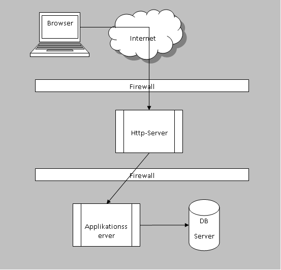
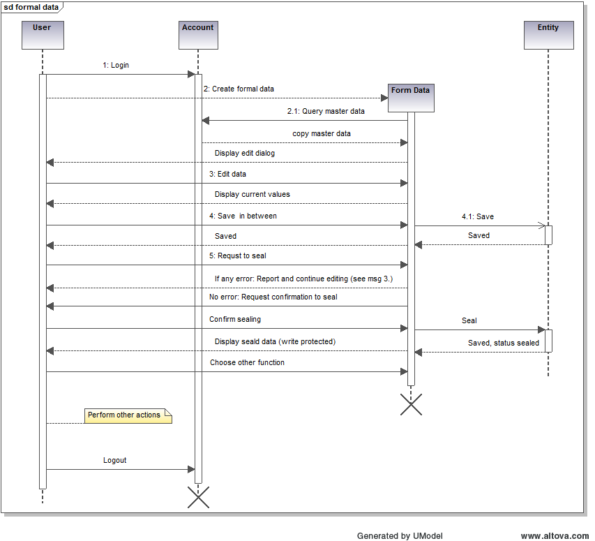

# InEK Datenportal

DataPortal ein das Modul von [DataPortalParent](../../../../Readme.md). 
Es handelt sich um die Hauptanwendung zur strukturierten Kommunikation mit Krankenhäusern und sonstigen externen Instituten oder Personen.

Zum Zeitpunkt des Projektstart (2011) erhält das InEK zahlreiche Datenlieferungen in unterschiedlichen Formaten per Mail. 
Das Verfahren ist fehleranfällig (Nicht-Einhaltung des Formats, verlorene Emails etc.) und soll daher durch ein Web-Portal ersetzt werden. 
Dieses Dokument beschreibt das Projekt "Inek Datenportal", welches beginnend in 2012 zur Übermittlung der Daten gem. §21 KHEntgG genutzt wird. 
Weitere Lieferfunktionen wie NUB, Vorschlagsverfahren und mehr werden sukzessive in diesem Portal implementiert.

## 1 Glossar

| Begriff | Erläuterung |
|---|---|
| DRG | Diagnosis Related Group. Eine Krankheitsgruppe, welche durch Diagnosen, aber auch Prozeduren und sonstigen klinischen oder demographischen Merkmalen beschrieben wird. Die Zuordnung eines Falls zu einer DRG erfolgt durch einen Grouper |
| DropBox | Benannter und zeitlich beschränkter privater Upload-Bereich,   den   ein Anwender für sich reservieren und zur Datenübermittlung an das InEK nutzen kann |
| Selbstverwaltungspartner im Gesundheitswesen | Deutsche Krankenhausgesellschaft, Spitzenverbände der Krankenkassen und der Verband der privaten Krankenversicherung |

## 2 Einführung und Zielsetzung

### 2.1 Projektvision / Aufgabenstellung

#### 2.1.1 Ausgangs-Situation (2011)

Neben den §21- und Kalkulationsdaten (KG-Info, KG-Ausbildung, OPAN etc.) fragt das InEK zahlreiche weitere Daten ab bzw. räumt berechtigten Personen die Möglichkeit ein, sich in unterschiedlichen Formen am Verfahren (NUB, VV, Anfragen) zu beteiligen. Hierzu senden diese Personen bzw. Institutionen Daten ein. Dies erfolgt teilweise in Form unterschiedlicher Excel-Dateien, teilweise in Form von Dateien die mit-tels spezieller Tools erzeugt wurden sowie CSV-Dateien gemäß § 21 KHEntG. Diese Daten werden dann per Email an das InEK übermittelt. Davon abweichend werden §21-Dateien derzeit per Email oder DropBox via Datenstelle an das InEK übermittelt.

Dabei kommt es immer wieder zu diversen Problemen:

* Es werden unzulässige bzw. unplausible Daten eingetragen
* Im Excel werden Felder verschoben, verändert, eingefügt
* Die vom Tool erzeugten Texte werden mit einem Editor nachbearbeitet und dabei in ihrer Struktur verändert.
* Emails gehen verloren
* Seitens Datenstelle werden Daten fehlerhaft verarbeitet bzw. bereitgestellt.

Die Folgen dieser Probleme sind geringere Datenqualität bis hin zum Datenverlust sowie ein erhöhter Aufwand durch manuelle Korrekturen während des Einleseprozesses sowie erforderlich werdende Neulieferungen.

#### 1.1.2 Zielsetzung
 Es wird ein Verfahren benötigt, das die genannten Probleme vermeidet bzw. soweit die Vermeidung nicht möglich ist, zumindest deutlich reduziert. Erreicht wird dies durch ein Bündel von Maßnahmen:

* Die Daten werden, wo immer möglich, bereits bei ihrer Erfassung überprüft, z. B. Zulässigkeit von Codes, Einhaltung von Wertegrenzen, Typprüfung etc.
* Zur vereinfachten Eingabe werden Assistenzfunktionalitäten wie das Suchen von Codes bereitge-stellt
* Die Formulare können vom Anwender nicht verändert werden.
* Die Datenübermittlung erfolgt auf sicherem Wege. Der Anwender erhält bei erfolgreicher Über-mittlung unmittelbar eine nachprüfbare Rückmeldung.
* Der Anwender wird authentifiziert, so dass insbesondere sensible Daten nicht von "irgendwem" geliefert werden.
* Es ist eine Arbeitsweise zu unterstützen, die auch eine Unterbrechung und Wiederaufnahme der Datenerfassung ermöglicht.

### 2.2 Qualitätsziele

* Für externen Anwender kurze Antwortzeiten (typisch < 1 Sek., unter hoher Last < 2 Sek., jeweils bei DSL-Anbindung)
* Keine formellen Fehleingaben möglich (Pflichtfelder gefüllt, korrekte Datentypen, Werte aus Werteliste)
* Kein unberechtigter Zugang, z.B. Admin-Funktionalität nur (räumlich) innerhalb vom InEK möglich

### 2.3 Beteiligte

Nennung der wichtigen Rollen (nicht Personen) und deren Interessen.

| Rolle | Interessen |
|---|---|
| Anwender| Einfache und sichere Übermittlung ihrer Daten |
| Gesetzgeber| Umsetzung der im Gesetz festgeschriebenen Aufträge an Selbstverwaltung und InEK. Einhaltung von Datenschutzbestimmungen, insbesondere im Hinblick auf sensible Patientendaten. |
| Selbstverwaltung| Delegation der gesetzlichen Aufträge an das InEK und korrekte Durchführung derselben |
| InEK (GF) | Korrekte Umsetzung der Aufgaben. Positive Außenwirkung. |
| InEK (Medizin) | Qualitativ hochwertige Daten als Grundlage für die weitere Bearbeitung |
| InEK (Ökonomie) | Dokumentierte Lieferungen als Grundlage für die Kommunikation mit den Häusern. Qualitativ hochwertige Daten als Grundlage für die weitere Bearbeitung. |
| InEK (Datenstelle) | Sichere Datenannahme mit einfacher Übernahme in eine Datenbank. Automatisierbare Verarbeitung. |
| InEK (Anwender) | Sichtung der Formulardaten. Kommentierung der Daten. Bearbeitung der Daten. |

## 3 Anforderungen

### 3.1  Use cases

Als Anwender möchte ich in der Lage sein,

* Daten gemäß § 21 zu liefern
* Ergänzende  Daten zu liefern
* Daten Kalkulationsgrundlage zu liefern
* Förmliche Anfragen zu stellen
* NUB zu übermitteln
* Vorschläge zur Weiterentwicklung von DRG- und PEPP-Systems zu unterbreiten
* Dokumente unterschiedlicher Art an das InEK zu übermitteln
* Protokolle und sonstige Dokumente abzurufen

Diese kurze Übersicht zeigt bereits eine Menge von Anwendungsfällen auf. Auch wenn inhaltlich verschieden lassen sie sich technisch gesehen in wenige Gruppen einteilen, so dass sich die Zahl der technisch unterschiedlichen Anwendungsfälle reduziert:
* Lieferung von CSV-Dateien (teilweise Massendaten)
* Übermittlung förmlicher Daten

Damit dies dem Anwender ermöglicht wird, sind aber auch administrative Tätigkeiten erforderlich, wie Registrierung, Anmeldung etc., die teilweise vom Anwender, teilweise vom InEK durchzuführen sind. Hierbei handelt es sich um zusätzliche Anwendungsfälle.

[Detaillierte Beschreibung ausgewählter Anwendungsfälle](../asciidoc/UseCases.adoc)

### 3.2  Funktionale Anforderungen

Das InEK Datenportal dient der strukturierten Übermittlung von Daten an das InEK. 
Aufgrund der recht umfassend dargestellten Use Cases, wird hier auf eine detaillierte Beschreibung der übergreifenden funktionalen Anforderungen (z.B Registrierung, Anmeldung etc.) weitgehend verzichtet.
Für Anforderungen einzelner Features wird auf die entsprechenden Dokumente verwiesen.

[Kalkulationshaus](calc/CalculationHospital.md)

### 3.3 Nicht funktionale Anforderungen

* Kurze Antwortzeiten für die Anwender. Als Messlatte gilt hier < 1 Sek. bei Normallast und Nutzung einer DSL-Verbindung, < 2 Sek. bei höherem Datenaufkommen (100 Anwender parallel)
* Minimierung von Angriffsmöglichkeiten wie DoS, SQL-Injection etc.
* Keine bzw. kleinstmögliche Kompromittierung der Datensicherheit im InEK-Netz, insbesondere kein direkter Zugriff aus der DMZ auf die Datenbank
* Qualität der Dateneingaben: Keine Abstürze aufgrund inkompatibler Typen bei Übernahme in die Datenbank

### 3.4 Technische Anforderungen

* Nutzung des vorhandenen SQL Servers zur Datenspeicherung
* Linux als Betriebssystem für Rechner in DMZ

### 3.5 Schnittstellen

#### 3.5.1 Datenlieferungen gem. §21 

Die Daten werden verschlüsselt geliefert und bleiben verschlüsselt. 
Eine Inhaltliche Analyse ist daher im Datenportal nicht möglich.
Es wird eine einfache Dateischnittstelle genutzt, um die Daten weiter zu leiten.

Die Daten werden nach Freigabe in ein Zip-Archiv gepackt und anschließend in das Übergabeverzeichnis verschoben. 
In diesem Zusammenhang erhält das Archiv den Namen "BoxyyyyMMddHHmmssSSS.zip" mit yyyy = Jahr, MM = Monat, dd = Tag, HH = Stunde, mm = Minute, ss = Sekunde und SSS = Millisekunde. 
Dabei stellt die Applikation die Eindeutigkeit des Dateinamens sicher.

#### 3.5.2 ICMT

#### 3.5.3 NUB

#### 3.5.4 Vorschlagsverfahren DRG

#### 3.5.4 Vorschlagsverfahren PEPP

## 4 Lösungsstrategie

### 4.1 Portallösung

Im Dokument 01_WebDatenlieferung.doc wurden bereits alternative Verfahren betrachtet. 
Es wurde entschieden, die genannten Ziele durch Einführung einer Web-Portallösung zu erreichen. 
Dabei steht allen Anwendern ein einheitliches Portal zur Verfügung, dessen Funktionsumfang durch entsprechende Anmeldungen und Freischaltung zur Verfügung steht.
Als technische Basis wird ein Java EE kompatibler Applikationsserver genutzt. 
Für die Dialoggestaltung werden JavaServer Faces eingesetzt. 
Es wird also im Wesentlichen eine Technologie genutzt, wie sie bereits für die Entwicklung der WebGrouper für Swiss und Zypern zum Einsatz kam.

Ein Prototyp ist in oben genanntem Dokument ebenfalls beschrieben.

### 4.2 Applikationsserver und Datenhaltung
Das Web-Portal muss einerseits vom Internet aus erreichbar sein. 
Eine direkte HTTP-Verbindung von außen in das InEK-Netz wird aus Sicherheitsgründen vermieden. 
Die Annahme der Verbindungen erfolgt daher außerhalb des InEK-Netzes in der DMZ. 
Andererseits ist aus ebensolchen Sicherheitsgründen der Zugriff auf die Datenbank nur innerhalb des InEK-Netzes zulässig. 
Es wird daher in der DMZ ein HTTP-Server installiert, der die eingehenden Verbindungen prüft. 
Soweit diese an das Datenportal adressiert sind, leitet der Server diese auf einem anderen Port an einen Applikationsserver, der sich im InEK-Netz befindet. 
Dort befindet sich die eigentliche Applikation inklusive der Datenhaltung.

Dies ist schematisch in der folgenden Abbildung dargestellt.

Die Oberfläche der Portal-Applikation orientiert sich am Look-and-Feel der InEK-WebSite.
Sie kann von dort via Link aufgerufen werden und erhält umgekehrt Links auf die Homepage. 
Sie ist aber nicht integraler Bestandteil der InEK-WebSite, da diese bei einem externen Anbieter gehostet wird, während sich der Applikationsserver im InEK befindet. 

### 4.3 Anbindung ICMT-Daten

Im InEK ist ICMT das zentrale Tool zur Aministration von Kontaktdaten. 
Hierzu gehören u.a. die Stammdaten der Krankenhäuser, Softwarehersteller, Berater etc., zusammen mit den jeweiligen Ansprechpartnern. 
Dabei kann ein Ansprechpartner durchaus für verschiedene Krankenhäuser zuständig sein. 
Für Funktionen, die einer Freischaltung durch das InEK bedürfen, ist der Zugriff auf diese Daten von Vorteil, um einfacher über die Freigabe der Funktion zu entscheiden. 
Die Daten im ICMT bleiben werden vom Datenportal nicht verändert; es erfolgt also nur ein lesender Zugriff.

Soweit im ICMT Daten von Portalanwendern benötigt werden, greift das ISMT lesend auf die Daten des Portals zu. 
Dies gehört nicht zum Umfang dieses Dokuments.

### 4.4 Anbindung Datenempfänger

Die über das Portal übermittelten Daten sind für unterschiedliche Systeme bestimmt. 
Letztendlich landen sie in den jeweiligen Datenbanken. 
Der Anwender darf Daten vor der endgültigen Übermittlung zwischenspeichern. 
Dabei werden die Daten gespeichert wie sie sind – also möglicherweise unvollständig und unplausibel und damit ungeeignet für die Zieldatenbank. 
Sie werden daher von der Portal-Applikation verwaltet und in einen gesonderten Bereich gespeichert. 
Erst wenn der Anwender die Daten als "fertig" markiert erfolgen (erweiterte) Plausibilitätsprüfungen, die eine Verträglichkeit der Daten mit nachfolgenden Prozessen garantieren. 
Erst zu diesem Zeitpunkt werden die Daten entweder als bereitgestellt markiert, in der Datenbank des jeweiligen Empfängers gespeichert oder zur Abholung durch einen Prozess bereitgestellt.

## 5 Architekturüberblick

### 5.1 Bausteinsicht

#### 5.1.1 Ebene 1 (Vogelperspektive)

Zusammenspiel der Bausteine,  z.B. zentrale Pakete oder Klassen, vorzugsweise grafisch dargestellt (UML)

##### 5.1.1.1 Bausteinname 1

Beschreibung als Blackbox

##### 5.1.1.2 Bausteinname 2

Beschreibung als Blackbox

#### 5.1.2 Ebene 2

"Zoom" in wichtige Bereiche, Optional auch dritte Ebene

### 5.2 Laufzeitsicht

Die Einlieferung von Daten erfolgt in strukturierter Form über definierte Verfahren. 
Auch die DropBox ist letztendlich ein bestimmtes Formular.

Den vereinfachten Ablauf für die Erfassung bzw. Übermittlung von Daten zeigt das folgende Diagramm.

Solange der Anwender eingeloggt ist, existiert ein entsprechendes Account-Objekt. 
Wird nun ein Formular angelegt, so erzeugt das System intern ein entsprechendes Datenobjekt, das initial mit Werten aus dem Account befüllt werden kann. 
Der Anwender kann die Daten editieren und zu jedem Zeitpunkt (zwischen-) speichern. 
Die Funktion [Speichern und bereitstellen] "versiegelt" die Daten und stellt sie dem InEK zu weiteren Bearbeitung bereit. 
Bei Auswahl einer anderen Funktion wird das Datenobjekt zerstört. 
Dies gilt auch, wenn das Objekt weder gespeichert noch abgeschlossen wurde.

Im Diagramm nicht dargestellt ist der Fall, dass ein zwischengespeichertes Objekt zu einem späteren Zeitpunkt weiter bearbeitet wird. 
Bei der späteren Bearbeitung wird die Nachricht 2. durch "load existing object" ersetzt. 
Die Daten werden via "load" vom Datenservice abgeholt und der Editier-Dialog angezeigt. 
Der weitere Ablauf erfolgt wie beschrieben.

### 5.3 Verteilsicht

## 6 Konzepte

Die Realisierung des InEK-Datenportals erfolgt serverseitig in Java unter Verwendung eines JEE7 (oder jünger) kompatiblen Applikationsservers. 
Für die Oberflächenentwicklung wird JSF (JavaServer Faces) eingesetzt. 
Die Datenhaltung erfolgt entsprechend der InEK-Infratruktur auf einem SQL Server.

### 6.1 Fachliche Strukturen und Modelle

### 6.2 Typische Muster und Strukturen

### 6.3 Benutzeroberfläche

Die Applikation präsentiert sich dem Anwender im Browser. 
Die Bedienung lehnt sich an die für viele Anwender bekannte Bedienung grafischer Programme an, 
nutzt also intensiv Elemente wie Textfelder, Auswahllisten, Schaltflächen, Radio-Knöpfe usw..

#### 6.3.1 Dialogführung

Nach erfolgreicher Anmeldung gelangt der Anwender zu einer Übersicht, zu der er jederzeit zurückkehren kann. 
Diese zeigt die möglichen Dienste und listet eine kleine Anzahl entsprechender Datensätze auf. 
Von dieser Übersicht kann der Anwender direkt die Datenerfassung aufrufen, zu den einzelnen Datenbereichen navigieren oder aber grundlegende Aktionen wie Stammdatenänderungen, Abmelden etc. aufrufen. 
Diese grundlegende Dialogführung ist dem Dokument 01_WebDatenlieferung.doc, unter Prototyp beschrieben, so dass hier auf eine erneute Darstellung verzichtet wird. 
Zu beachten ist, dass der Prototyp noch nicht alle Anwendungsfälle berücksichtigt. 
Insofern ist die Darstellung unvollständig; das Funktionsprinzip ist jedoch bereits dort gut erkennbar. 
Die tatsächliche Realisierung wird hier nicht dargestellt, da diese erst im Rahmen eines agilen, iterativen Entwicklungsprozesses erfolgt. 
Sie wird jedoch im Handbuch, das parallel zur Umsetzung entsteht beschrieben.

##### 6.3.1.1 Übersicht
Die Übersicht verschafft dem Anwender einen schnellen Überblick über verfügbare Funktionen sowie aktuellen Daten und erlaubt die Navigation zu den einzelnen Funktionsbereichen. 
Diese umfassen beispielösweise (ohne Beachtung einer logischen Reihenfolge)

* Stammdatenänderung – inklusive Löschung der Registrierung
* Neue Untersuchungs- und Behandlungsmethoden
* Vorschlagsverfahren DRG/PEPP
* DropBox-Verfahren
* Kalkulationsgrundlage
* Kooperationen
* ...

Abmelden ist hier nicht aufgeführt, da diese Funktionalität von jeder Seite erreichbar sein muss. 
Ebenso ist eine übergreifende Navigation nicht genannt. 
Diese ermöglicht beispielsweise den Aufruf der InEK-Homepage.

##### 6.3.1.2 Stammdaten

Stammdaten werden im Rahmen der Registrierung angelegt und können später in einem separaten Dialog editiert werden.
In den Stammdaten sind nicht nur grundlegende Daten wie Name, Firma, Anschrift hinterlegt. 
Vielmehr kann der Anwender über die Stammdaten auch das Verhalten des InEK Datenportals stauern.
Hiezu gehören beispielsweise genutzte Funktionalität, Nachrichtenempfang und mehr.

### 6.4 Geschäftsregeln

### 6.5 Persistenz

Die Daten werden auf einem MS-SQL Server gespeichert. 
Für den Zugriff werden nicht SQL-Statements, sondern ein objekt-relationales Mapping genutzt. 
Dies verhindert zuverlässig eine SQL-Injection.
Zum Einsatz kommt hier JPA. 

Sollte in begründeten Ausnahmefällen der Einsatz einer nativen SQL-Anweisung erforderlich sein,
wird diese mit den dynamischen Anteilen parametrisiert ("prepared statement"), um auch an dieser Stelle SQL-Injection zu unterbinden.

#### 6.5.1 [Datenbanktabellen KGL] (KGLTables.md)

### 6.6	DropBox

Der Anwender kann sich selber für das DropBox-Verfahren registrieren. 
Dies generiert eine Nachricht an das InEK, welches die Nutzung des DropVerfahrens explizit freischaltet (oder ablehnt). 
Nach Freischaltung kann der Anwender selber beliebige DropBoxen anlegen und nutzen.

Eine DropBox ist nur für einen bestimmten Zeitraum nutzbar. 
Nach Ablauf dieser Zeit kann sie nicht mehr verwendet werden und wird lediglich in der Historie gezeigt.

Der Anwender kann beliebige Dateien in die DropBox legen oder auch löschen. 
Den Abschluss dieser - unterbrechbaren – Arbeiten bildet eine aktive Bereitstellung der Daten ("Submit"-Button). 
Nun könnte es vorkommen, dass der Anwender vergisst, die Daten bereit zu stellen, bevor die Gültigkeit abläuft. 
Sollen in einem solchen Fall die bereits hinterlegten Daten übernommen und somit automatisch bereitgestellt werden? 
Da auf Seiten der Datenannahme nicht bekannt ist, ob diese Daten vollständig sind, werden keine Daten automatisch übernommen. 
Nur, wenn der Anwender die Daten aktiv bereitstellt, erfolgt eine weitere Bearbeitung. 
Läuft die Gültigkeit einer DropBox ab, wird diese daher automatisch und ohne Rückfrage gelöscht. 
Dies ist im Anwenderhandbuch entsprechend dakomentiert.

### 6.7	Code-Suche

Codes (Diagnosen, Prozeduren, …) können über ihren Text gesucht werden. 
Die Suche ist so gestaltet, dass der Anwender ein oder mehrere Textfragmente eingibt. 
Werden alle gefunden, so erscheint der betreffende Kode in der Ergebnisliste und kann dann ausgewählt werden.

Als zu durchsuchender Text werden dabei neben der Bezeichnung des Codes auch der Code selbst sowie Alternativbezeichnungen und Synonyme entsprechend dem alphabetischen Verzeichnissen des DIMDI genutzt. 
Zur Aufbereitung der Suchbegriffe dient das Hilfsprogramm IcdAlpha. 

### 6.8 Datenzugriff durch InEK Mitarbeiter

Während die "normalen" Anwender neben allgemeinen Templates nur Zugriff auf die eigenen Dateien haben, muss es den Mitarbeitern im InEK möglich sein, für bestimmte Bereiche Zugriff auf alle Daten zu erhalten. 
Hierzu ist ein abgestuftes Berechtigungskonzept vorgesehen. 
Dies definiert je Mitarbeiter und (Datenportal-) Feature, welcher Art der Zugriff ist (keiner, nur lesend, lesend und schreibend). 
Diese Definition erfolgt über ein Rollenkonzept:

Rolle {Id, Bezeichnung, Feature, Schreibzugriff}
MapAccountRolle {Account, Rolle}

Ist eine Rolle für ein Feature definiert, so erlaubt diese abhängig vom Flag Schreibzugriff den lesenden oder schreibenden Zugriff. 
Bei fehlender Rollendefinition ist kein Zugriff auf das entsprechende Feature möglich.
Neben den tatsächlich vorhandenen Features ist noch das Feature "ADMIN" definiert, welches sämtliche Features beinhaltet.

Einem Anwender (account) können 0 bis n Inek-Rollen zugewiesen werden.

Die erweiterten InEK-Funktionalitäten stehen nur dann zur Verfügung, wenn die Anmeldung im lokalen Neztwerk erfolgt.
Bei Anmeldung von außerhalb können sie also nicht genuzt werden.

### 6.9 SessionController

JSF arbeitet mit "Managed" oder "Named" Beans. 
Während die managed beans in der JSF-Spezifikation festgeschrieben sind, entstammen die named beans der CDI. 
Beide Typen werden vom Container (Applikationsserver) verwaltet und haben definierte Lebenszeiten wie Anfrage, Sitzung, Applikationsdauer. 
Ruft der Anwender das Web-Portal im Browser auf, so startet damit implizit eine Sitzung (Session). 
Diese endet gemäße HTTP-Standard mit Schließen des Browsers oder Erreichen eines Timeouts. 

Bestimmte Informationen sind für die Dauer einer Session vorzuhalten.
Hierzu dient der SessionController.

Eine Session wird anhand eines kleinen Datensatzes, der auf Browserseite gespeichert wird erkannt.
Ein Diebstahl dieses Datensatzes kann zum Erlangen eines unberechtigten Zugriffs führen.
Die Anmeldung wie auch der weitere Zugriff auf das InEK Datenportal erfolgt grundsätzlich über eine verschlüsselte Verbindung (HTTPS).
Diese verhindert das Auspähen der Daten durch Lauschen an der Leitung.
Der SessionController verändert die Session-Kennung bei erfolgter Anmeldung.
Damit wird eine eventuell vor Nutzung der Verschlüsselung gestohlene Session-Kennung unbrauchbar und die Übernahme einer Session durch Unberechtigte verhindert.

Bei der Anmeldung eines Anwenders werden die freigeschalteten Funktionalitäten (Klassen, in Form von Beans) beim SessionController registriert. 
Diese stellen dann Informationen für die Navigation sowie die Übersichtsseite zur Verfügung. 
Die Verwaltung erfolgt also über den SessionController. 

### 6.10 Übersicht, dynamischer Inhalt

Die Übersicht stellt die "Schaltzentrale" der Applikation dar. 
Der Inhalt ist jedoch stark abhängig von den individuell zur Verfügung stehenden Diensten (DropBox, formale Datenübermittlung, ...). 
Ein solcher Dienst wird im Folgenden als "Feature" bezeichnet. 
Jedes Feature kann sowohl Einträge in Navigation wie auch im Inhaltsbereich zur Verfügung stellen. 
Realisiert wird jedes Feature als Bean, die einer einheitlichen Schnittstelle "FeatureController" folgt, über welche die Hauptapplikation polymorph die Einträge für Navigation respektive Inhaltsbereich abruft.

### 6.11 Spezielle Konzepte einzelner Funktionen

#### 6.11.1 Kooperative Rechtevergabe

Das InEK Datenportal steht jedem offen. 
Insofern sind – soweit kein IK Admin (siehe unten) eingerichtet – alle externen Anwender "gleich". 
Ein jeder Anwender kann erst einmal nur die Daten sehen, die er selbst erfasst. 
Arbeiten in einem Krankenhaus mehrere Personen an einem Thema, kann es sinnvoll sein, die Daten eines anderen Anwenders lesen oder bearbeiten zu können. 
Hierfür sind dem Anwender spezielle Rechte zu erteilen. 

Ist ein IK-Admin eingerichtet, so erfolgt die Rechtevergabe über diese Instanz. 
Im Standard-Fall, also ohne IK-Admin, bedeutet Rechtevergabe, dass der Besitzer der Daten dem anderen Anwender die Zugriffsrechte erteilen kann. 
Hier steht also ein kooperierender Gedanke im Vordergrund. 
Entsprechend wird diese Art der Rechteverwaltung im Folgenden als "kooperative Rechtevergabe" bezeichnet.

Die Rechtevergabe setzt voraus, dass der andere Anwender auch existiert. 
Anders als in einem sozialen Netzwerk sind die Anwender im InEK Datenportal nicht öffentlich sichtbar. 
Auch erfolgt bei der Angabe der "fremden" Anwenderkennung / E-Mail-Adresse keine Rückmeldung, ob diese existiert, um ein Test auf Vorhandensein zu unterbinden. 
Stattdessen muss der eingetragene Anwender sich erst als Kooperationspartner bestätigen. 
Bestätigte Kontakte können in der Rechtevergabe wie auch für andere Funktionen, z.B. Nachrichtenversand, genutzt werden.

Optional: Um zu verhindern, dass ein Anwender von ein und demselben anderen Anwender immer wieder mit Kooperationsanfragen bombardiert wird, kann ein anfragender Anwender blockiert werden.

##### 6.11.1.1	Erteilbare Rechte

Ein Anwender kann dem Kooperationspartner für seine Daten diese Rechte (in unterschiedlichen Kombinationen) zuweisen:

* Kein Zugriff
* Lesen
* Ändern
* (Als Supervisor) ans InEK senden
* Besitz übernehmen

Die Zuweisung erfolgt getrennt für jedes Feature, das eine kooperative Rechtevergabe unterstützt. 
Je nach Feature kann diese Rechtevergabe auch getrennt nach IK erfolgen.

Soweit kooperativ oder ein IK-Supervisor eingerichtet ist, kann ein Anwender – sofern nicht selbst Supervisor für diese Funktion – seine Daten nicht mehr an das InEK senden. 
Der entsprechende Button wir ausgetauscht durch einen "zur Freigabe durch Partner".

Hat ein Anwender von einem Kooperationspartner Rechte erhalten, so werden die "fremden" Daten bei den betreffenden Features in eigenen Listen (je Partner) geführt.

Die Zugriffsrechte innerhalb des jeweiligen Features werden in eine zentrale Abfrage gekapselt.

##### 6.11.1.2 IK-Admin

Beim Datenportal gibt es keine zentrale Benutzeranlage. 
Es kann sich jeder am Portal anmelden und diverse Funktionen nutzen. 
Bestimmte Funktionen haben einen direkten Bezug zu einem bestimmten Krankenhaus, repräsentiert mittels eines Institut-Kennzeichens (IK). 
Während viele Benutzer die dezentrale Benutzeranlage begrüßen, gibt es aber auch solche, die eine zentrale Kontrolle der Aktivitäten für ihr IK wünschen. 
Hierfür dient die Funktion des IK-Amins. 
Diese Rolle kann für ein IK durchaus mehreren Anwendern zugeteilt werden. 
Diese Rolle wird einem Anwender manuell durch den System-Admin des Datenportals zugewiesen. 
Diesem Vorgang geht zwingend eine Prüfung voraus, ob der Anwender diese Rolle überhaupt einnehmen darf. 
Dies ist organisatorisch zu regeln, z.B. durch schriftliche Anfrage bei der betreffenden Krankenhausleitung.

Der IK-Admin kann für das betreffende IK

* Die Liste der Anwender mit Bezug zu diesem IK einsehen
* Festlegen, welcher Anwender welche Funktion für dieses IK nutzen kann
* Die "kooperative" Rechtevergabe überschreiben

##### 6.11.1.3 IK-Supervisor

Im Rahmen der kooperativen Rechtevergabe kann ein Anwender darauf verzichten, Daten an das InEK zu übermitteln. 
Diese Tätigkeit gibt er damit an einen Supervisor ab. 
Ist (mindestens) ein IK-Supervisor vorhanden, so kann der Anwender – sofern nicht selbst der IK-Supervisor – keine Daten mehr an das InEK übermitteln. 
Diese Freigabe erfolgt dann zwingend durch einen IK-Supervisor.

Ein IK-Supervisor wird vom InEK manuell für die Kombination einer IK und einer Funktion, z.B. NUB, eingerichtet. 
Voraussetzung ist eine entsprechende Erklärung der betreffenden Krankenhausleitung. 
Die Krankenhausleitung ist verantwortlich, eine gewünschte Rücknahme der IK-Supervisorrechte an das InEK zu melden.

##### 6.11.1.4 Freigabe-Buttons

Jeder Datensatz, z.B. eine Nub-Anfrage, ein DRG-Vorschlag etc. kann beliebig editiert und zwischengespeichert werden. 
Ist der Datensatz fertig erfasst, wird er direkt oder über eine Prüfinstanz (Supervisor) an das InEK übermittelt.
Dafür stehen alternativ zwei Buttons zu Verfügung:

1. Zur Freigabe an Kooperationspartner
2. Senden ans InEK

#### 6.11.2 NUB

Im Rahmen der kooperativen Rechtevergabe kann der Besitzer dem Kooperationspartner alle unter 6.11.1 Kooperative Rechtevergabe benannten Rechte einräumen.
 
Die Berechtigung, die NUB-Anfrage an das InEK zu senden, ist auch ohne Änderungsrecht erteilbar. 
Es ist also möglich, dass die Bereitstellung durch einen anderen Anwender erfolgen kann, dieser die Anfrage aber nicht ändern darf. 
In einem solchen Fall muss der Anwender dem Besitzer jedoch mitteilen können, warum die Daten möglicherweise nicht an das InEK gesendet werden können.
Dies ermöglicht die Funktion "Nachricht an XXX". 
Eine solche Nachricht ist auch außerhalb des NUB-Kontextes möglich, setzt aber grundsätzlich voraus, dass der Empfänger freigeschaltet ist (Bestätigung einer "Kontaktanfrage").

In der Datenbank werden neben der AccountID des Besitzers auch die des letzten Editors sowie des Bereitstellenden vermerkt.

Ein Anwender erhält mehrere Listen mit NUB-Anfragen:

1. Liste der eigenen NUB-Anfragen mit Status kleiner "bereitgestellt"
2. Liste der NUB-Anfragen von Kooperationspartnern mit Status kleiner "bereitgestellt"
3. Liste der eigenen NUB-Anfragen mit Status ab "bereitgestellt"
4. Liste der NUB-Anfragen von Kooperationspartnern mit Status ab "bereitgestellt"

In seltenen Fällen könnte es vorkommen, dass zwei Anwender gleichzeitig eine Anfrage bearbeiten. 
Da dies relativ selten vorkommt und noch seltener die gleichen Felder geändert werden, wird auf die Implementierung eines Lockmechanismus verzichtet. 
Stattdessen wird beim Speichern geprüft, ob der Datensatz zwishcnezeitlich geändert wurde.
Sollte dies der Fall sein, werden die Änderungen zusammengeführt.
Sollten tatsächlich einmal mehrere Anwender gleichzeitig das selbe Feld geändert haben, so kann für dieses Feld kein automatischer Abgleich stattfinden.
Der Anwender wird entsprechend benachrichtigt.

Ist ein IK-Admin eingerichtet, erfolgt die Rechtevergabe zentral über diesen.

#### 6.11.3 Modellvorhaben

Während bei anderen Funktionen der Anwender selbst neue Datensätze anlegt, unterscheidet sich der Ablauf bei der Erfassung von Modellvorhaben davon:

1. Die Vertragspartner benennen dem InEK einen Ansprechpartner. Nur dieser ist zur Erfassung der Vertragsdaten (=Modellvorhaben innerhalb des Portals) befugt.
2. Das InEK prüft, ob dieser Ansprechpartner im Portal registriert ist. Falls nicht, wird die Registrierung angefordert und abgewartet.
3. Das InEK legt im Portal ein neues Modellvorhaben an und weist dieses dem Account des Ansprechpartners zu.
4. Der Ansprechpartner erfasst die Vertragsdaten und signalisiert deren Vollständigkeit durch "ans InEK senden".
5. Das InEK prüft die Daten. Sofern unvollständig oder unplausibel, wird das Vorhaben wieder in den Edit-Modus versetzt (zurück zu Schritt 4).
6. Das InEK vergibt ein Vertragskennzeichen.

Der Ansprechpartner kann seinen Kooperationspartnern jederzeit Lesezugriff, wahlweise für alle oder nur für "ans InEK gesendete", gewähren.

Daraus folgt:
* Nur berechtigte InEK-Mitarbeiter (Schreibrecht MVH) können ein Modellvorhaben anlegen
* Aufgrund der geringen Menge (erwartet werden ca. 20 Modellvorhaben), wird keine Funktion zur Zuweisung des Accounts erstellt; dies erfolgt durch ein entsprechendes manuelles Update in der DB 
* Nur der "Eigentümer" (Ansprechpartner) darf über das Portal die Vertragsdaten, nicht aber das Vertragskennzeichen editieren: Das Vertragskennzeichen wird als Label angezeigt. Sofern nicht vergeben: "- noch nicht erteilt -"
* Dem Eigentümer erhält in Datenportal eine Liste aller ihm zugeordneten Modellvorhaben
* Soweit einem Kooperationspartner Leserecht eingeräumt wurde, erhält dieser alle Modellvorhaben, die er lesen darf im Datenportal, gruppiert nach "Eigentümer" gelistet
* Berechtigte InEK-Mitarbeiter (Schreibrecht MVH) können das Vertragskennzeichen eintragen, nicht aber die sonstigen Vertragsdaten via Datenportal editieren. Das Vertragskennzeichen wird als Eingabefeld gezeigt
* Berechtigte InEK-Mitarbeiter (Lese- oder Schreibrecht MVH) erhalten im Datenportal alle Modellvorhaben gruppiert nach "Eigentümer" gelistet

### 6.12 Weitere relevante Konzepte

## 7 Qualitätsszenarien

Wie wird die Software geprüft? Z.B. Unittests, automatisierte Systemtests, Tests entsprechend Checkliste.

## 8 Risiken

Bereits im Rahmen früher Überlegungen wurde festgelegt, keine Daten in der DMZ zu speichern und auch keinen direkten Zugriff aus der DMZ auf die Datenbank zu erlauben. 
Der Zugriff auf die Daten erfolgt über einen zweiten Applikationsserver, der im InEK-Netz beheimatet wird. 
Die Kommunikation mit dem Anwender erfolgt über einen verschlüsselten Kanal (HTTPS).

Dies vorausgeschickt, erfolgen hier weitere Überlegungen zu möglichen Angriffsvektoren sowie deren Abwehr.

### 8.1 Mögliche Angriffsvektoren und deren Abwehr

Im Folgenden werden mögliche Angriffsvektoren gelistet. 
Daraus abgeleitet werden Maßnahmen, die entweder innerhalb oder außerhalb des Web-Portals erfolgen. 
Soweit die Maßnahmen nicht innerhalb der zu entwickelnden Applikation erfolgen, sind sie hier im Wesentlichen nur kurz erwähnt. 
Maßnahmen innerhalb der Applikation haben dagegen direkten Einfluss auf die Programmentwicklung.

#### 8.1.1 Unberechtigter Zugriff auf den HTTP-Server (DMZ)

Sollte es einem Eindringling gelingen, Zugriff auf den HTTPS-Server oder gar Kontrolle über diesen zu erlangen, so besteht die Möglichkeit, diesen zu missbrauchen. 
Auf dem HTP-Server in der DMZ werden jedoch keine Daten vorgehalten, so dass ein möglicher Schaden entsprechend begrenzt ist. 
Vom HTTP-Server kann jedoch eine Verbindung mit dem Applikations-Server aufgenommen werden.
Für diesen gelten weitere Sicherheitsmaßnahmen:

* Für den Zugriff auf ein Benutzerkonto ist die Kenntnis der Zugangsdaten (Login + Kennwort) erforderlich, so dass diese entsprechend geschützt sind.
* Zur Vermeidung eines Brute-Force-Angriffs werden die möglichen Loginversuche pro Zeiteinheit beschränkt.
* Der Zugriff auf die Daten ist auf geeignete Weise an ein erfolgreiches Login zu knüpfen
* Bei längerer Inaktivität erfolgt ein automatisches Logout

Vorrangiges Ziel ist jedoch, zu verhindern, dass eine unberechtigte Person überhaupt in das System eindringen kann. 
Dieses Ziel ist jedoch nicht über die Applikation, sondern über geeignete Maßnahmen, die für das gesamte Netz gelten, zu erreichen. 
Diese Maßnahmen sind von der Systemadministration festzulegen und durchzuführen.
Sie liegen außerhalb des Fokus dieses Dokuments.

#### 8.1.2 Direktzugriff auf die Datenbank

Innerhalb des InEK-Netzes ist ein direkter Zugriff auf die Datenbank möglich. 
Dies ist erforderlich, damit die berechtigten Personen vernünftig mit diesen Daten arbeiten können.
Da ein solcher Zugriff am Web-Portal vorbei erfolgt, liegt dieser nicht im Fokus der Programmentwicklung und damit außerhalb dieses Dokuments. 

Es gelten die gleichen Schutzmaßnahmen wie für alle anderen Datenbanken: 
Durch geeignete, von der Systemadministration festzulegende Maßnahmen, wird verhindert, dass Unberechtigte in das InEK-Netz eindringen oder sonst wie Zugriff auf die Daten (z.B. via Datensicherung) erhalten.

Für den Zugriff auf die Daten durch den Applikationsserver sowie berechtigte Personen werden nur die minimal erforderlichen Rechte vergeben.

#### 8.1.3 Denial of Service (DoS)

Bei diesem Angriff wird versucht, den Server durch eine hohe Anzahl von Zugriffen in einen betriebsunfähigen Zustand zu versetzen. 
Es handelt sich vornehmlich um einen Angriff auf den Server selbst und weniger auf die Applikation. 
Der vorgeschaltete HTTP-Server wird seitens der Administration entsprechend dem Stand der Technik geschützt.

Innerhalb der Applikation ist ein verstärkter Zugriff nicht im Sinne eines DoS, sondern zum Austesten von Logins denkbar. 
Dies ist in 8.1.1 "Unberechtigter Zugriff auf den Applikationsserver (DMZ)" beschrieben.

#### 8.1.4 SQL-Injection
Der Angreifer versucht, durch Eingabe von SQL-Ausdrücken in den Eingabefeldern die Kontrolle über das System zu erlangen oder Daten zu manipulieren.

Beispiel: 
Das Login erfolge über ein dynamisch erstelltes SQL-Statement "… where password = ´" + Eingabe + "´"
Der Angreifer gibt im Kennwortfeld "’ or ´x´=´x" ein.
Damit wird das Statement automatisch zu "… where password = ´ ´ or ´x´=´x´" ergänzt und ein Login erfolgreich.

SQL-Injection wird im Rahmen der sicheren Programmentwicklung verhindert.

* Eingabefelder werden unmittelbar validiert, so dass sie nur gültigen Inhalt enthalten
* Parametrisierte Abfragen erfolgen ausschließlich via JPA und werden nicht wie im obigen Beispiel dynamisch zusammengebaut. Dies sorgt für eine sichere Erstellung der Statements entsprechend der sogenannten "Prepared Statements".

### 8.2 Beschränkung Anwender

#### 8.2.1 Anwenderkonten

Am System sollen sich nur Personen mit berechtigtem Interesse anmelden. 
Dies kann vom System automatisch nicht überprüft werden. 
Insofern ist die Registrierung für alle Personen möglich. 
Um die Registrierung einzuschränken, ist der Login nur für solche Personen möglich, die über eine gültige Email verfügen. 
Zur Überprüfung wird an die hinterlegte Email ein Aktivierungscode versandt.
Erst nach Empfang derselben und Klick auf die Aktivierung ist ein Zugang zum System möglich. 
Da eine Email mehr oder weniger öffentlich ist, wird zur Aktivierung zusätzlich das Kennwort abgefragt.
Nicht aktivierte Konten werden automatisch nach Ablauf von drei Tagen entfernt.

* Die Bestätigung der Email ist auch bei Änderung derselben via Stammdatenpflege erforderlich.

Sensible und von einem kleineren Anwenderkreis genutzte Funktionalitäten, wie DropBoxen, müssen aktiv durch das InEK freigeschaltet werden. 
Soweit diese an eine IK geknüpft sind, muss die Freischaltung nach Änderung der IK erneut erfolgen.

#### 8.2.2 Anmeldungen

Für jeden Anwender ist zeitgleich nur eine Anmeldung zulässig. 
Dies wird durch eine geeignete Login-Verwaltung im Rahmen der Programmierung umgesetzt.

Die Umsetzung dieser Anforderung ist nicht prioritär, eventuell ist es auch sinnvoll stattdessen die Anzahl der Anmedlungen zu beschränken (z.B. auf drei).

## 9 Anwenderdokumentation

Das Anwenderhandbuch wird innerhalb des Projekts verwaltet. 
Die Quellversion befindet sich im Verzeichnis "manual". 
Im PDF-Format steht es dem Anwender in "resources/manual" zur Verfügung ist über einen Link innerhalb des InEK-Datenportals erreichbar.

## 10 Deployment / Konfigurationsmanagement

### 10.1 Entwicklungssystem

Die Entwicklung erfolgt mittels NetBeans. 
Genutzt wird hier das JavaEE-Bundle, dass neben der eigentlichen Entwicklungsumgebung bereits einen Applikationsserver (GlassFish) umfasst.

### 10.2 Zielsystem

* HTTP-Server DMZ: Linux (Ubuntu), Apache http ab 2.2
* Applikationsserver: Windows ab XP, GlassFish ab 3.1
* Datenbank InEK-Netz: Windows Server ab 2008, SQL Server ab 2012

## 11 Sonstiges

Projektspezifische Besonderheiten
 
